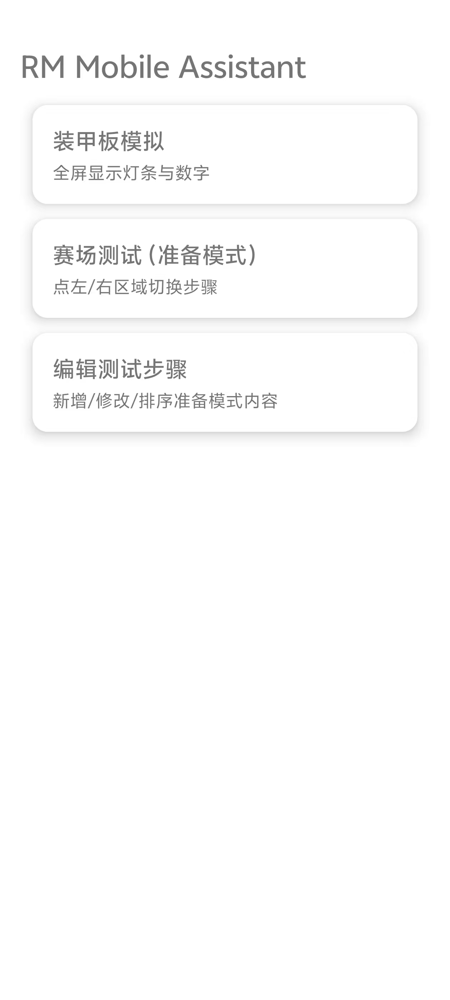

# RM Mobile Assistant

一款为 RoboMaster 比赛设计的 Android 辅助工具，用于赛前测试与显示辅助。

---

## ✨ 功能简介

- **装甲板模拟**
    - 全屏显示灯条与数字
    - 点击屏幕切换颜色

- **赛场测试（准备模式）**
    - 文字提示轮播
    - 左 / 右区域点击切换步骤

- **测试步骤编辑**
    - 新增 / 编辑 / 删除步骤
    - 调整顺序并保存

---

## 📱 界面预览



---

## 🔧 技术栈

- Android Studio
- Kotlin
- View / XML Layout
- SharedPreferences

---

## 🚀 使用说明

1. 安装 APK (不想看代码直接下载apk即可)    **注意如果用微信发送apk时会自动在apk后加.1,如app-debug.apk.1,请在手机自带的文件管理器中找到文件,删除文件名后面的.1**
2. 打开应用进入主界面
3. 选择所需功能模块

---

## 📦 APK

APK 位于：[APK](APK)

---

## 📂 项目结构

```text
RMMobileAssistant/
├─ app/                         # Android 应用主模块
│  ├─ src/main/
│  │  ├─ java/com/example/rmmobileassistant/
│  │  │  ├─ MainActivity.kt     # 主界面：功能入口（装甲板 / 赛场测试 / 编辑）
│  │  │  ├─ ArmorActivity.kt    # 装甲板模拟：全屏灯条与数字显示
│  │  │  ├─ FieldTestActivity.kt# 赛场测试：步骤轮播 / 点击切换
│  │  │  ├─ StepEditorActivity.kt # 步骤编辑器：增删改排序测试流程
│  │  │  ├─ Step.kt             # 步骤数据模型（title / desc）
│  │  │  └─ StepsRepo.kt        # 步骤持久化（SharedPreferences）
│  │  ├─ res/
│  │  │  ├─ layout/             # XML 界面布局
│  │  │  ├─ values/             # 字符串 / 主题 / 颜色
│  │  │  └─ mipmap/             # App 图标资源
│  │  └─ AndroidManifest.xml    # 应用配置与入口声明
│  └─ build.gradle              # 模块构建配置
├─ assets/                      # README 使用的截图资源
│  └─ screenshot_home.png
├─ README.md                    # 项目说明文档
└─ build.gradle                 # 项目级 Gradle 配置
```